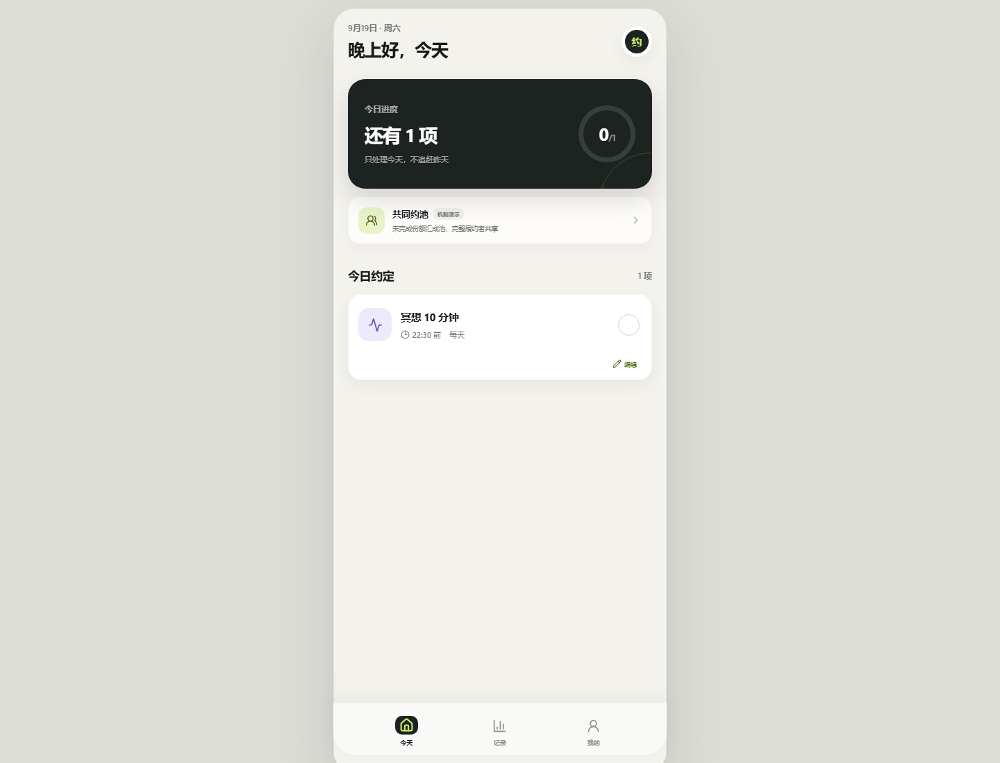

# 约己 · YUEJI

> 把目标缩成今天的一件事。做完就结束。

约己是一款极简承诺打卡产品：把一个大目标缩成今天的一件事，用明确的完成动作和低打扰随记帮助用户完成承诺。网页、PWA、原生微信小程序和支付服务端放在同一个仓库，当前共同约池仍是机制演示。

## 在线体验

- 主站（Cloudflare）：<https://yueji-e39.pages.dev/>
- 备用站（GitHub Pages）：<https://daizhetang-create.github.io/yueji/>
- GitHub：<https://github.com/daizhetang-create/yueji>

## 60 秒演示

1. 打开主站，创建今天要完成的一件事。
2. 设置完成时间、每周出现日和目标说明。
3. 完成后点击“一键完成”，再决定是否留下星级和文字随记。
4. 打开“记录”和“我的”，查看自己的履约轨迹。
5. 在共同约池演示中查看个人本金、共同奖励和履约资格的分账展示。

## 真实边界

- 当前共同奖励只展示机制，不发生真实奖励转账。
- 真实收款、跨用户奖励、申诉冻结、商户付款和法务/财税审查仍是上线前门槛。
- 支付服务端代码用于链路演示和测试，不代表已经开放真实支付。



## 当前已经具备

- 极简网页 / PWA：今天、记录、我的；一键完成、自由编辑时间与每周出现日、自定义目标、本机持久化、添加到主屏幕。
- 主动实践随记：完成后不自动打扰，只有用户点击“记一下”才出现星级与文字入口。
- 共同约池 V0.3 机制演示：个人本金与共同奖励分账展示、完整履约资格、一次暂缓；当前明确不发生真实奖励转账。
- 原生微信小程序工程：与网页一致的三页结构、约池规则、主动随记与编辑能力，可直接导入微信开发者工具。
- 微信支付服务端链路：小程序登录、JSAPI 承诺金下单、客户端调起支付、回调验签解密、内部退款接口。
- 支付 RSA、API v3 AES-GCM、个人结算与约池分配预览自动测试；GitHub Pages 与 Cloudflare 自动部署。

真实收款不会使用演示数据。跨用户共同奖励还需要独立奖励账本、可复核完成证据、申诉冻结、商户付款能力以及法务/财税审查；这些门槛完成前，页面始终显示“机制演示”。

## 工程结构

```text
src/        网页 / PWA
miniapp/    原生微信小程序
server/     微信登录、支付与退款服务
docs/       云端网站构建产物（GitHub Pages 自动读取）
planning/   产品、支付、自动打卡与研究文档
```

## 本地运行

```powershell
npm install
npm run dev
```

支付服务：

```powershell
Copy-Item .env.example .env
npm run server
```

完整检查：

```powershell
npm run check
```

确认发布新版本后：

```powershell
npm run publish -- -Message "说明这次更新"
```

该命令会依次检查、构建网站、提交并推送 GitHub、更新 GitHub Pages，再把根路径版本发布到 Cloudflare Pages。两个网址同步完成，不需要分别上传。

## 文档

- [今天能完成什么，以及后续上架顺序](./planning/01-产品与上线路线.md)
- [全球竞品与学术证据](./planning/02-全球竞品与学术证据.md)
- [微信支付承诺金接入](./planning/03-微信支付接入.md)
- [原生 App 自动打卡](./planning/04-自动打卡与原生App.md)
- [共同约池 V0.3 与设计端 AI 反向审查任务书](./planning/08-共同约池V0.3与设计端AI反向审查.md)
